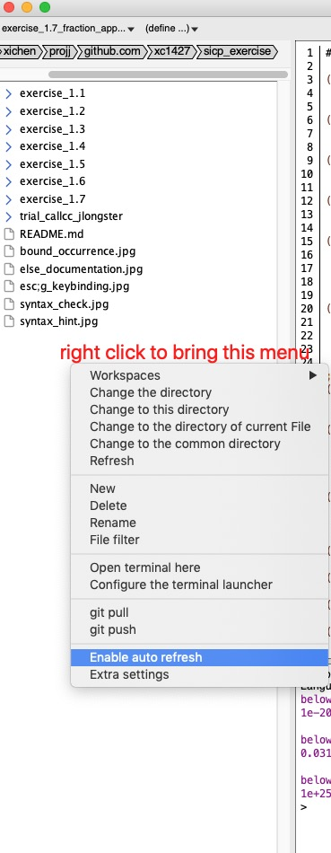
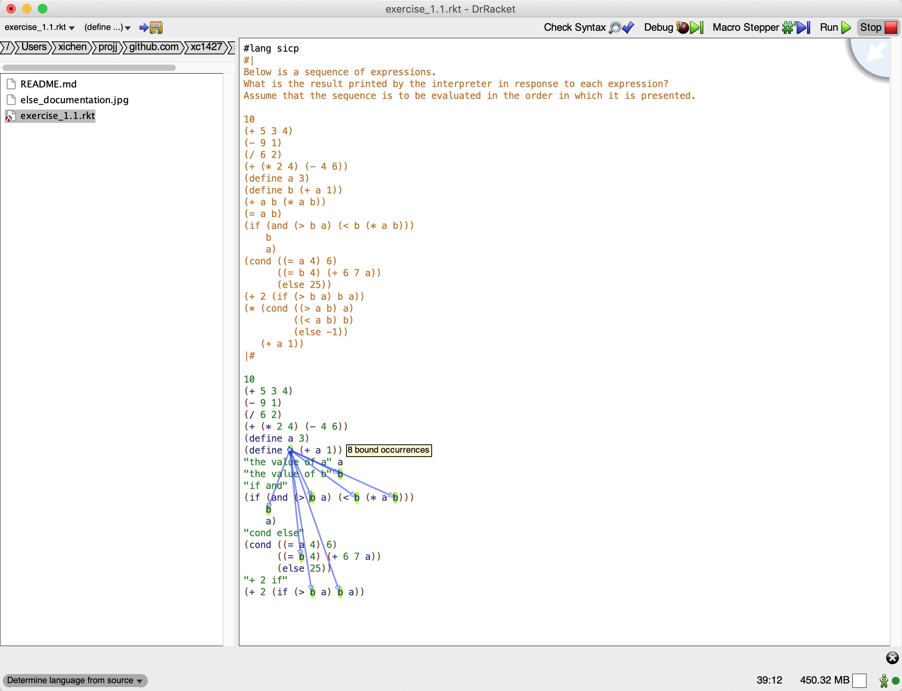
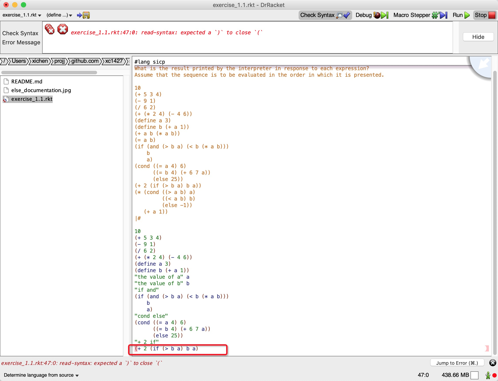
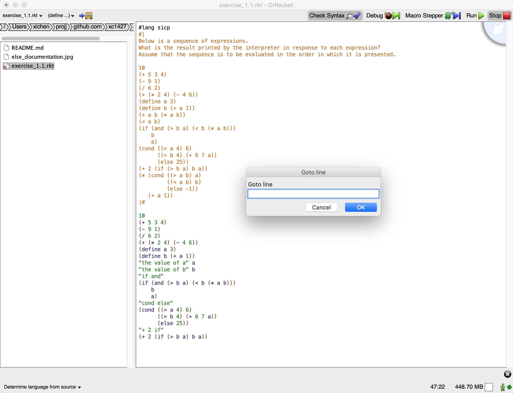
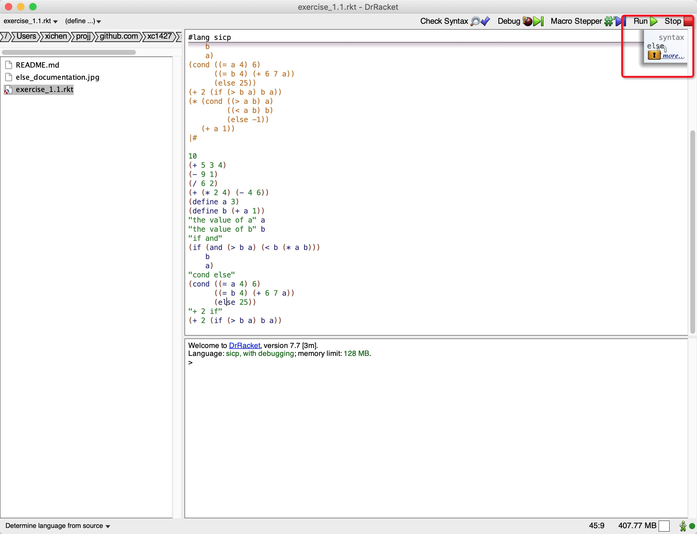
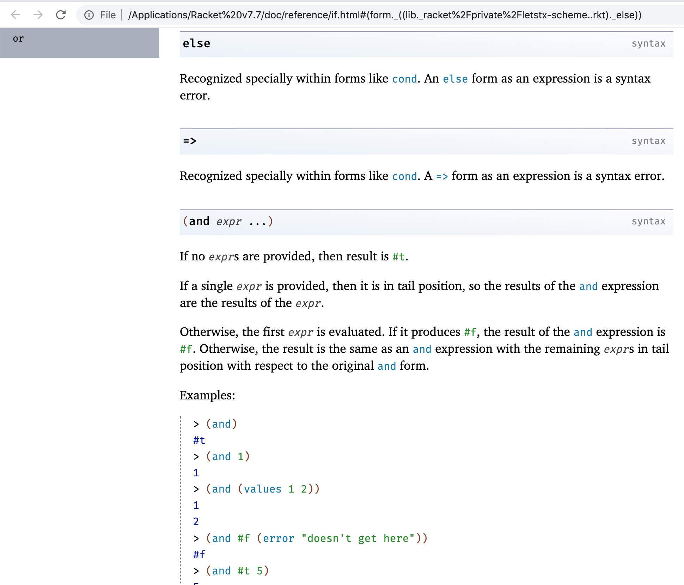

## Introduction

This is my solutions to exercises in the book [sicp](https://mitpress.mit.edu/sites/default/files/sicp/index.html). It is in WIP status. I wish to finish it in the year of 2021.

## Install Scheme

Doing exercises is equally important to reading the materials, especially for sicp. Because the author purposely includes lots of things which are not explained in the reading part and you can only get it by exploring the exercises.

To do exercises simply means to program, and to program in `scheme` language. It is an old language and to install the version used in this book (MIT Scheme) is not a easy task.

`Racket` is a dialect of the Lisp language, and one that is based on the Scheme branch of the Lisp family ([See detailed introduction](https://docs.racket-lang.org/guide/dialects.html)). While, it is said that some trivial work needs to be done in terms of compatibility with MIT Scheme, it is much easier to install and configure on MacOS, than to say, MIT Scheme, and it has a *sicp collection* (active it by putting `#lang sicp` at the first line of the .rkt file) which is an ideal compagnie to the study of the book.

Install Racket and Dr.Racket(Official IDE shipped with Racket): https://download.racket-lang.org/ Choose the right version, download and install it.

Install sicp collection: https://stackoverflow.com/questions/19546115/which-lang-packet-is-proper-for-sicp-in-dr-racket/19561746#19561746

Install file-viewer: [Files-viewer: a file manager plugin for DrRacket](https://docs.racket-lang.org/files-viewer/index.html), and enable "auto fresh".

## Choose to use Dr.Racket

Dr.Racket serves quite well. It has many surprisingly useful features.

It provides arguably the most idiomatic scheme language support such as syntax check, variable occurrence highlighting (even with additional arrows pointing to them 😲, I think this is "cyberpunk" example in reality). See following examples,

One of the modern IDE feature it provides is keybindings. For example, to go to a specific line, press `Esc` then `g`,

It pops up some useful link to syntax documentation,

when clicked, doc page is opened,

## Configure VS Code for supplementary support

I use VS Code for viewing/editing the markdown file in this project, making new files and new directories, which is a little inconvenient in Dr.Racket.

Install the [Magic Racket for VS Code](https://marketplace.visualstudio.com/items?itemName=evzen-wybitul.magic-racket), which gives a better language support, although I do not explore many of the features of this plugin.

## How to execute the .rkt program

Open .rkt file in IDE Dr.Racket, and click the `Run ▷` button on the top left, or simply press `cmd + r`.