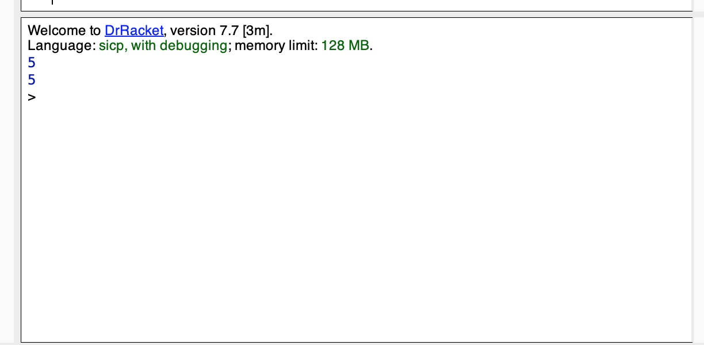

Exercise 1.4: Observe that our model of evaluation allows for combinations whose operators are compound expressions. Use this observation to describe the behavior of the following procedure:

```scheme
(define (a-plus-abs-b a b)
  ((if (> b 0) + -) a b))
 ```

## answer
a plus abs of b

```
(a-plus-abs-b 2 3)
(a-plus-abs-b 2 -3)
```
