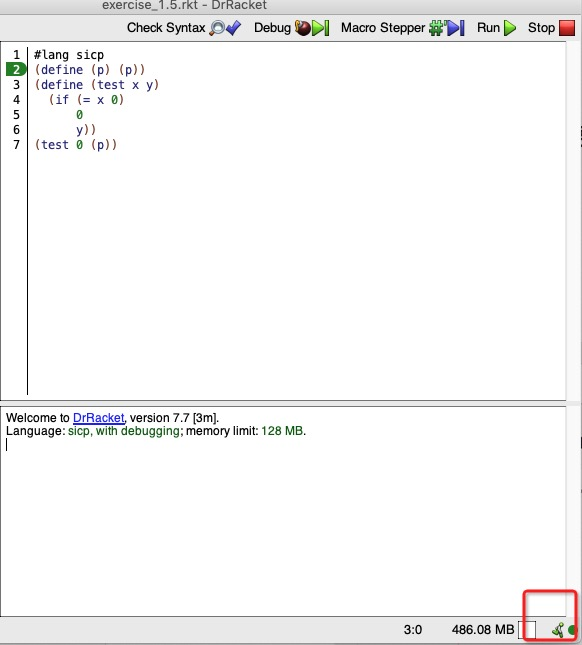

Exercise 1.5: Ben Bitdiddle has invented a test to determine whether the interpreter he is faced with is using applicative-order evaluation or normal-order evaluation. He defines the following two procedures:

```scheme
(define (p) (p))

(define (test x y)
  (if (= x 0)
      0
      y))
```
Then he evaluates the expression

`(test 0 (p))`

What behavior will Ben observe with an interpreter that uses applicative-order evaluation? What behavior will he observe with an interpreter that uses normal-order evaluation? Explain your answer. (Assume that the evaluation rule for the special form if is the same whether the interpreter is using normal or applicative order: The predicate expression is evaluated first, and the result determines whether to evaluate the consequent or the alternative expression.)

## answer
In the case of *applicative-order evaluation*, the procedure `p` runs infinitely. That's because `p` is defined in a recursive way. If it were written in a javascript style, it would be like:

```js
function p() { p() }
```
So `p` will not stop running before `(test 0 (p))` has a chance to be evaluated.




On the contrary, in the case of *normal-order evaluation*, the evaluation of `(p)` is deferred. In the example above, the `if` statement will return 0 and finish; `(p)` has no chance to be evaluated.
