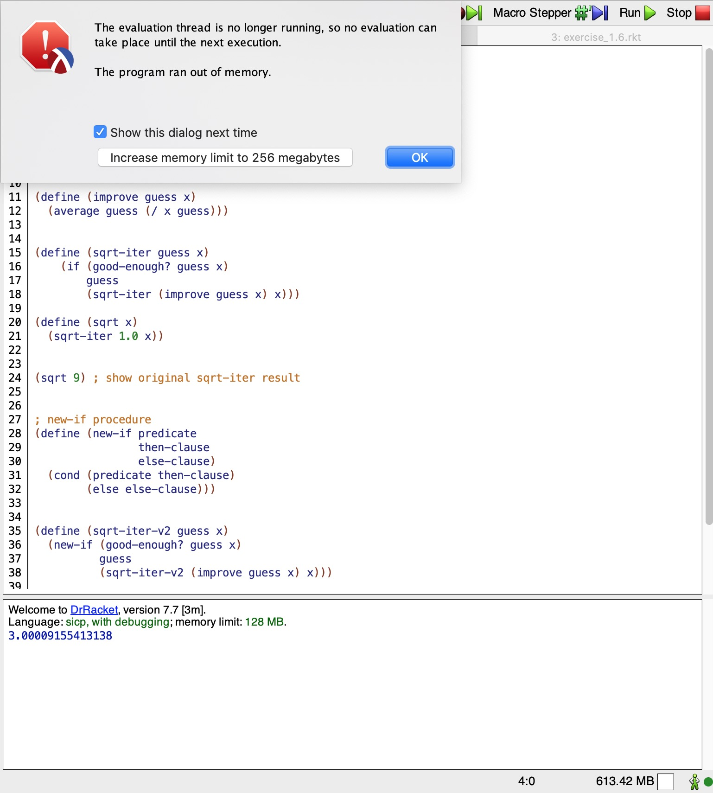
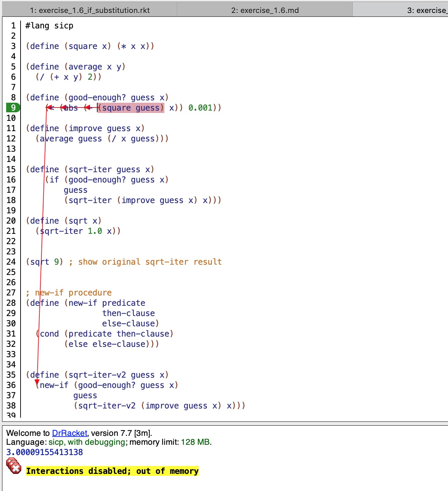

Exercise 1.6: Alyssa P. Hacker doesn’t see why if needs to be provided as a special form. “Why can’t I just define it as an ordinary procedure in terms of cond?” she asks. Alyssa’s friend Eva Lu Ator claims this can indeed be done, and she defines a new version of if:

```scheme
(define (new-if predicate
                then-clause
                else-clause)
  (cond (predicate then-clause)
        (else else-clause)))

```
Eva demonstrates the program for Alyssa:

```scheme
(new-if (= 2 3) 0 5)
5

(new-if (= 1 1) 0 5)
0
```
Delighted, Alyssa uses new-if to rewrite the square-root program:

```scheme
(define (sqrt-iter guess x)
  (new-if (good-enough? guess x)
          guess
          (sqrt-iter (improve guess x) x)))
```

What happens when Alyssa attempts to use this to compute square roots? Explain.

## Answer


after closing the dialog,



Above shows an "OOM" error. The procedure runs infinitely.

`new-if` is a normal procedure. So its operands are evaluated first, which makes the `predicate` never executed , then the recursive termination condition never met.