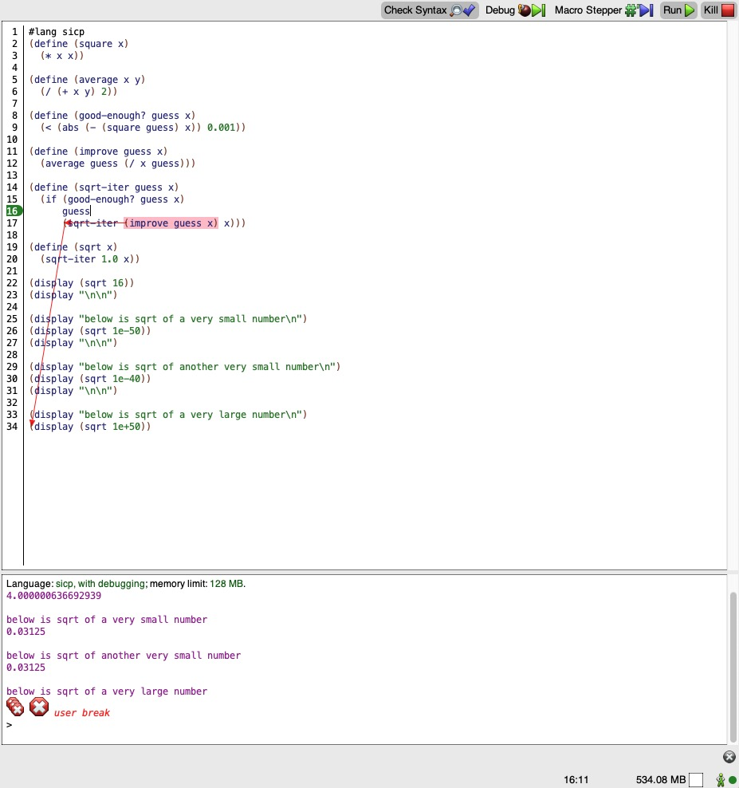
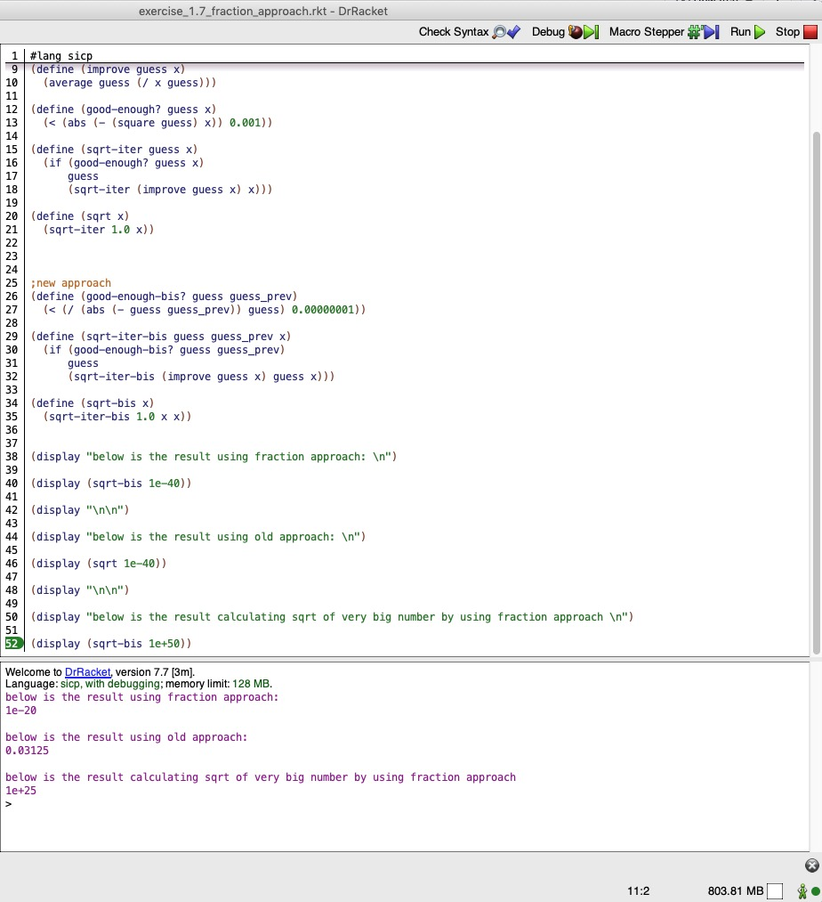

Exercise 1.7: The good-enough? test used in computing square roots will not be very effective for finding the square roots of very small numbers. Also, in real computers, arithmetic operations are almost always performed with limited precision. This makes our test inadequate for very large numbers. Explain these statements, with examples showing how the test fails for small and large numbers. An alternative strategy for implementing good-enough? is to watch how guess changes from one iteration to the next and to stop when the change is a very small fraction of the guess. Design a square-root procedure that uses this kind of end test. Does this work better for small and large numbers?

## Answer:

So from the author's statement we kind of know that:
- we can always start with `guess` = 1.0. This has nothing to do with small and large number.

- the `improve` procedure has nothing to do with small and large numbers. We should investigate the <ins>stop test</ins>, i.e., `good-enough?` procedure.


```scheme
(define (good-enough? guess x)
  (< (abs (- (square guess) x)) 0.001))
```

reduced to,

```scheme
(< (abs (- (square guess) x)) 0.001)

;with guess initially being 1.0
;with x being very small number / very large number
```
Whenever `x` is very small or very large, we can be sure that the `improve` procedure will definitely bring `guess` to be closer and closer to `x`, in terms of value, iteration by iteration.

Case : very small `x`.

When `x` being very small and `guess` definitely going to be "enough" small, the `(abs (- (square guess) x))` will produce a value smaller that 0.001 "effortlessly". So iteration stops early than the moment it should be to produce a much more precise result.

Case: very large `x`.

When `x` being very large and `guess` definitely going to be "enough" large, Even a small change on `guess` brought by `improve` procedure will make the `(abs (- (square guess) x))` change dramastically, So the stop test will never be satisfied; iteration never stops.

We can observe these on the following screenshot.




When `x` is very small, to say, `1e-50` and `1e-40`, the result makes no difference -- in both case, they are `0.03125`.

When `x` is very large, to say, `1e+50`, we see the program never stops and we had to stop it by killing the program.


### New approach : testing the fraction

We should be clear that the `good-enough?` procedure is not responsible for guessing the result of square root. Do not mess it with `improve` procedure, which will always try to give a "better" guess whatever `good-enough?` approach is used.

We implemented the new `good-enough-bis?` procedure, shown below,



we see that it is adequate to calculate the result of both very small and very large number.